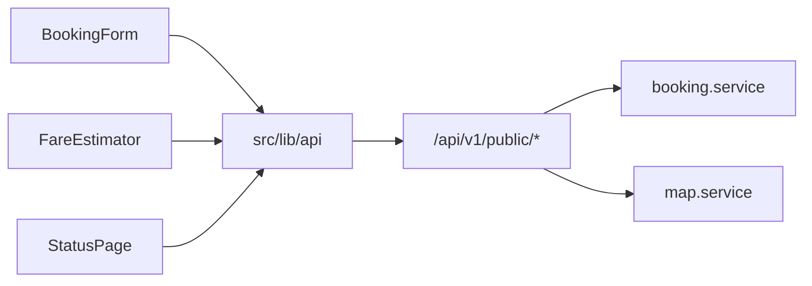

# Website ↔ API integration (guest + public track)

## Decisions (locked)

- **Guest booking now** via existing `POST /api/v1/public/bookings` (name + phone, no login).
- **Optional login / history** is a follow-up — not built in this pass.
- **Track** via new public endpoint: **booking reference + phone** must both match; wire [`src/routes/status.tsx`](src/routes/status.tsx) to real status (no fake timer stages).

## Backend additions

### 1. Public fare quote
Add `POST /api/v1/public/fare/estimate` in [`backend/src/api/v1/public/index.ts`](backend/src/api/v1/public/index.ts).

- Input: `vehicle_category_id`, `trip_type`, pickup/drop (text + optional lat/lng), optional `coupon_code` / `route_id`.
- Reuse the same tariff lookup + `calculateFare` path as [`booking.service.ts`](backend/src/services/booking.service.ts) `create` (extract a small `quoteFare` helper if needed so quote and create cannot drift).
- Response: distance_km, duration_minutes (if coords), fare breakdown (`estimated_total`, rate, batta, gst, etc.).

### 2. Public booking track
Add `POST /api/v1/public/bookings/track` (POST avoids putting phone in query logs).

- Body: `{ booking_reference, customer_phone }`.
- Lookup booking where both match (normalize phone digits); else 404 with generic message (no enumeration).
- Response: reference, status, trip_type, pickup/drop, pickup_at, estimated_total, payment_status, status_history (ordered), and if assigned: driver `{ name, phone }` + vehicle `{ name, registration }` (join `drivers` / `vehicles` — only safe public fields).
- Do **not** expose live GPS on this public route (auth-only location stays as-is).

### 3. Serialize / seed alignment
- Extend track payload as above (not only `serializeBooking`).
- Confirm seed vehicle categories cover site vehicles (Dzire, Ertiga, Innova, SUV, Tempo); if slugs differ, map in frontend by slug/name.

## Frontend integration

### 4. API client
Add [`src/lib/api.ts`](src/lib/api.ts):

- Base URL from `import.meta.env.VITE_API_URL` (already in [`.env.example`](.env.example)).
- Typed helpers: `getVehicleCategories`, `estimateFare`, `createBooking`, `trackBooking`.
- Envelope unwrap `{ success, data, message, errors }`; throw friendly errors.

### 5. Booking form → API
Update [`src/components/site/booking-form.tsx`](src/components/site/booking-form.tsx):

- Load vehicle categories from API (fallback to static [`site-data.ts`](src/lib/site-data.ts) if API down).
- Map UI trip labels → API `trip_type` (`One Way` → `one_way`, etc.).
- Build ISO `pickup_at` from date + time.
- On submit: `POST /public/bookings`; show API `booking_reference` + `estimated_total`.
- Keep WhatsApp as **secondary** “Notify desk” (prefilled with API ref), not the primary persistence path.
- Cache last success locally (ref + phone) for status deep-link convenience only.

### 6. Locations + distance
- Extend [`LocationField`](src/components/site/location-field.tsx) / [`location-search.ts`](src/lib/location-search.ts) so selecting a suggestion can pass `{ label, lat?, lng? }` into the form when available.
- When both coords exist, call fare estimate with coords; otherwise estimate uses server Haversine/route defaults from text+cities as create already does.

### 7. Fare estimator
Update [`src/components/site/fare-estimator.tsx`](src/components/site/fare-estimator.tsx) to call `fare/estimate` (or reuse categories + route estimate) instead of only local `base + km * rate`. Keep a local fallback if API unreachable.

### 8. Status page → real track
Rewrite [`src/routes/status.tsx`](src/routes/status.tsx) + slim [`src/lib/bookings.ts`](src/lib/bookings.ts):

- Form requires **reference + phone** (update copy; `?ref=` still prefills ref).
- Call `trackBooking`; map `BookingStatus` → timeline (`pending` → `confirmed` → `driver_assigned` → `on_the_way` / `arrived` → `trip_started` → `completed`; handle `cancelled` / `rejected`).
- Poll every ~20s while trip is active.
- Recent list: local cache of refs only; open still needs phone.

### 9. Config / CORS
- Local: `VITE_API_URL=http://127.0.0.1:3001` (or whatever backend port).
- Backend `CORS_ORIGINS` must include site origins (`http://localhost:4000`, `https://yaazhcabs.in`).
- Note in [`docs/cpanel-deploy.md`](docs/cpanel-deploy.md): rebuild site after setting `VITE_API_URL`.

## Out of scope (follow-up)

- Customer register/login UI and booking history.
- Live map tracking on `/status`.
- Replacing marketing CMS/FAQ content from API.

## Smoke test

1. Backend up + seed vehicles/tariffs.
2. Form submit creates booking; admin `bash scripts/admin.sh bookings` shows it.
3. `/status` with ref + phone shows `pending` → confirm/assign via admin script → status updates.
4. Fare estimator returns API total close to create response.
5. Wrong phone for a valid ref → not found.
